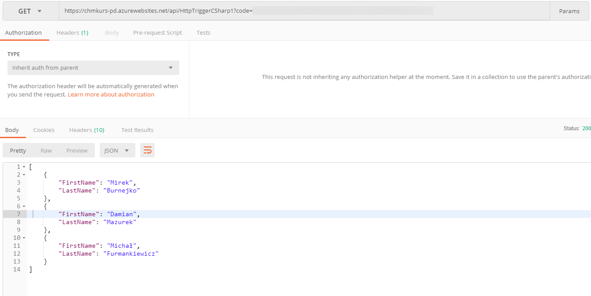

Azure function created for HW in *Microsoft Azure - understand every service* course provided by [Chmurowisko](https://chmurowisko.pl).

## Prerequisites

Before running this function you must have MySQL db up and running. You must have MySQL server, login into it and simply run create-db.sql file. It will create neccessary database, table and supply it with data.

## Running
If you set up everything correctly you can see somewhat similar response (presented in Postman):

